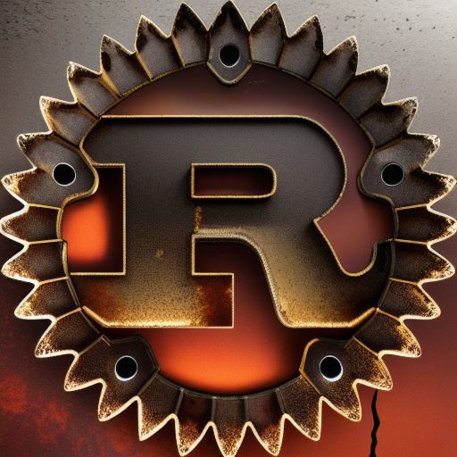
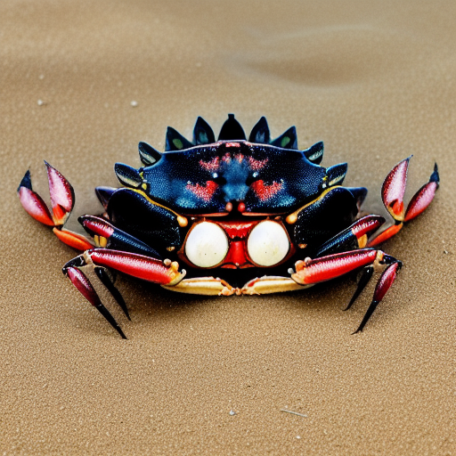

# LogoShogo
A repo with AI generated interpretations of OpenSource technology logos 
 
 
 This repo is a showcase of technology logos that have been built using StableDiffusion and ControlNet.

Its a lot of fun, and if you have your interpretations of the logos or made some for a different technology, please feel free to contribute.

The images here are free for anyone to use. You don't need to, but it would be cool if you link back to this repo - Enjoy! 😃

## Golang

More

      

## Rust

More

      
       

## Rust - Ferris:

More

##  Flask:

## Python (logo):

More

